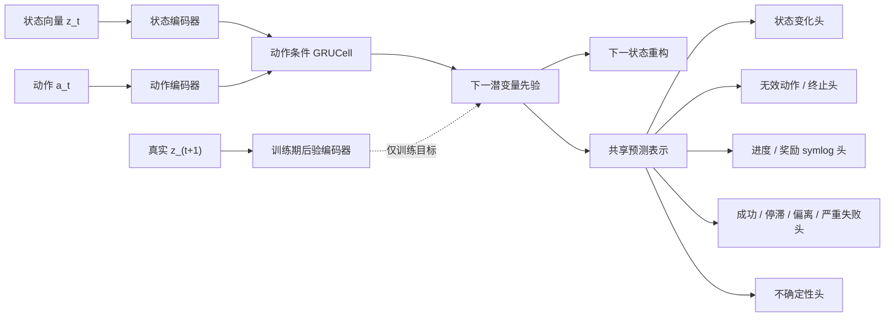

# 阶段二中期报告：动作条件世界模型

报告日期：2026-08-08（Asia/Shanghai）

## 阶段口径

依据 33.0 新申报书与修订技术路线，阶段二时间为 2026 年 8—11 月，目标是：

1. 扩充高质量浏览器轨迹与任务信号；
2. 建立不参与训练的 LLM 语义一步模型；
3. 训练动作条件一步潜在世界模型 W0；
4. 分别预测短期状态变化、进度、风险、无效动作和终止；
5. 通过 symlog/symexp 稳定数值信号；
6. 以离线预测、校准和 W0 在线重排作为验收证据。

本实现没有提前加入阶段三的 H>1 想象、搜索或闭环策略优化。

## 已实现系统

模型计算路径如下：

关键设计：

- 状态保持阶段一 512 维编码，动作使用独立的 128 维确定性特征哈希；
- 训练时以后验 `q(z_(t+1)|o_(t+1))` 约束动作条件先验；
- 分类头使用 BCE/focal loss，连续任务信号使用 symlog 后的 Smooth L1；
- 每个标签分别报告 F1、Brier 与 ECE，回归信号分别报告 MAE/MSE；
- W0 重排分数同时考虑进度、奖励、成功、风险与不确定性。

## 数据与质量控制

采集配置覆盖 30 个 MiniWoB 任务与 20 个随机种子，正式计划 600 个 episode。
20% episode/状态使用由种子固定的安全滚动探索，补充停滞和低进度样本，不执行
语法无效或破坏性动作。

数据管线具有以下门槛：

- 样本主键去重；
- 全 episode 分配到单一 split；
- 维度一致；
- P0 至少 500 条有效转移；
- P1 目标至少 3000 条有效转移；
- 弱监督标签与人工/LLM 标签通过 `label_source` 区分。

第一阶段已有 13 个 episode、26 条转移，数据升级测试通过且无重复、无 episode
泄漏；该规模仅用于验证管线，正式训练受 P0 门槛保护。

## 当前验收策略

配置中的首轮保守阈值：

| 指标 | 阈值 |
| --- | ---: |
| 状态变化 macro-F1 | ≥ 0.60 |
| 无效动作/终止 macro-F1 | ≥ 0.60 |
| 风险 macro-F1 | ≥ 0.50 |
| 潜变量余弦相似度 | ≥ 0.60 |

同时保留 progress/reward MAE、每标签 Brier/ECE 和样本支持数，不允许只报告总损失
或被多数类掩盖的准确率。类别在独立测试 split 中没有正/负支持时，报告必须注明，
不能把 F1=0 或空类别解释成模型失败/成功。

## 尚需形成的阶段结果

- 正式 P0/P1 数据卡；
- GPU 设备信息、AMP 状态、最佳 checkpoint；
- validation/test 逐头指标与阈值结论；
- W0 候选动作重排样例；
- 对失败类别、校准偏差和下一轮人工复核的误差分析。

以上条目必须由实际运行产物填写，不能用烟雾测试数字替代。
